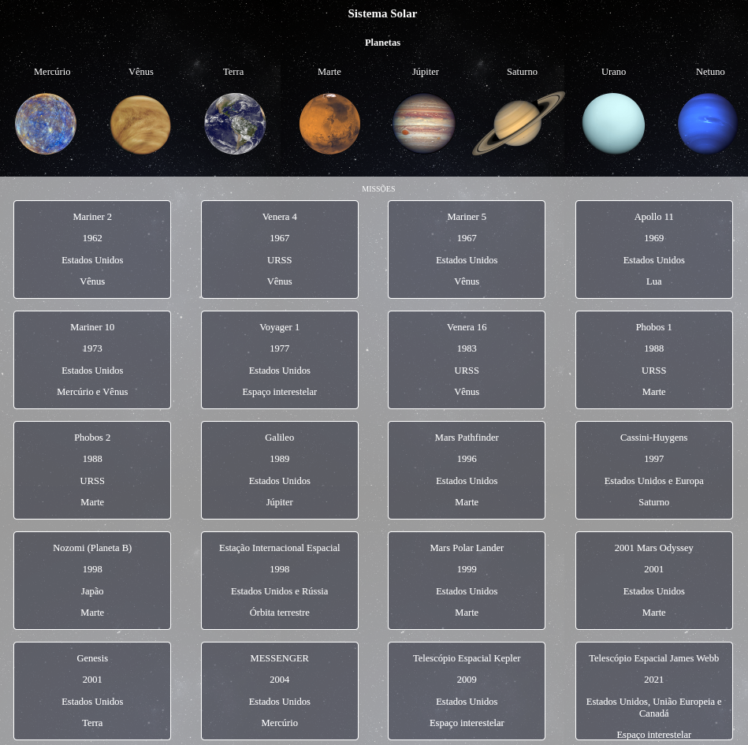

## Projeto desenvolvido através do curso de Desenvolvimento Web da Trybe. O projeto teve como objetivo o desenvolvimento de um modelo do sistema solar, onde a pessoa usuária consiga visualizar todos os planetas do sistema solar renderizados na tela e todas as cartas com informações sobre missões espaciais.

 

  

  
<strong>:memo: Habilidades</strong>
 

  * Utilizar JSX no React;

  * Utilizar corretamente o método `render()` para renderizar seus componentes;

  * Utilizar `import` para trazer componentes em diferentes arquivos;

  * Criar componentes de classe em React;

  * Criar múltiplos componentes a partir de um array;

  * Fazer uso de `props` corretamente;

  * Fazer uso de `PropTypes` para validar as `props de um componente`.

